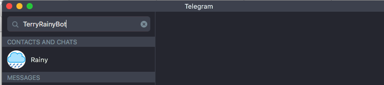
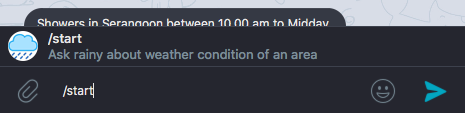

## Development
#### Register webhook
Paste the url in browser

https://api.telegram.org/bot<bot_token>/setWebhook?url=<lambda_webhook_url>

#### Getting started
```
cp config.sample config.prd.js
npm install
```

## Usage
1. Search for the bot username `@TerryRainyBot`


2. Tap start to initiate a conversation or just type `/start`


### Available commands
start - Ask rainy about weather condition of an area

tomorrow - Ask rainy for upcoming weather condition